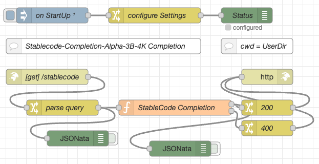

# node-red-flow-stablecode-completion-alpha-3b-4k #

Node-RED Flows for the StableCode-Completion-Alpha-3B-4K AI model

This repository contains a function node for [Node-RED](https://nodered.org/) which can be used to run the [Stability AI](https://huggingface.co/stabilityai) [StableCode-Completion-Alpha-3B-4K model](https://huggingface.co/stabilityai/stablecode-completion-alpha-3b-4k) within a Node-RED flow. **Inference is done on the CPU** (without requiring any special harware) and still completes within a few seconds on a reasonably powerful computer.

> **Important: in contrast to my other flows for AI models, this one does not use llama.cpp but a similar program called [ggml](https://github.com/ggerganov/ggml)**



Additionally, this repo also contains a function node to tokenize a prompt - embeddings calculation based on this model is not yet supported.

Having the inference, tokenization and embedding calculation as a self-contained function node gives you the possibility to create your own user interface or even use it as part of an autonomous agent.

> Nota bene: these flows do not contain the actual model. You will have to download your own copy directly from [Huggingface](https://huggingface.co/TheBloke/stablecode-completion-alpha-3b-4k-GGML) (use file [stablecode-completion-alpha-3b-4k.ggmlv1.q8_0.bin](https://huggingface.co/TheBloke/stablecode-completion-alpha-3b-4k-GGML/blob/main/stablecode-completion-alpha-3b-4k.ggmlv1.q8_0.bin)).

> Just a small note: if you like this work and plan to use it, consider "starring" this repository (you will find the "Star" button on the top right of this page), so that I know which of my repositories to take most care of.

## Installation ##

This section shows you how to install Node.js, Node-RED, GGML and the flows from this repository - feel free to skip the steps for those components you already installed before.

### Node.js ###

"_[Node.js](https://nodejs.org/en) is a cross-platform, open-source server environment that can run on Windows, Linux, Unix, macOS, and more. Node.js is a back-end JavaScript runtime environment, runs on the V8 JavaScript engine, and executes JavaScript code outside a web browser._" (according to [Wikipedia](https://en.wikipedia.org/wiki/Node.js))

Start by [installing Node.js](https://nodejs.org/en) as described on their web page.

### Node-RED ###

"_[Node-RED](https://nodered.org/) is a flow-based, low-code development tool for visual programming developed originally by IBM..._" (according to [Wikipedia](https://en.wikipedia.org/wiki/Node-RED))

If not already done, install Node-RED as described on their "[Get Started](https://nodered.org/#get-started)" page.

### GGML ###

[GGML](https://github.com/ggerganov/ggml) is a "Tensor library for machine learning" written in C

From all of the examples in that project, we only need GPT-NeoX. Install it as described in its [README](https://github.com/ggerganov/ggml/tree/master/examples/gpt-neox) file, but skip the conversion step - we will download an already converted model instead:

```
git clone https://github.com/ggerganov/ggml
cd ggml
mkdir build && cd build
cmake ..
make -j
```

Afterwards, 


## License ##

[MIT License](LICENSE.md)
